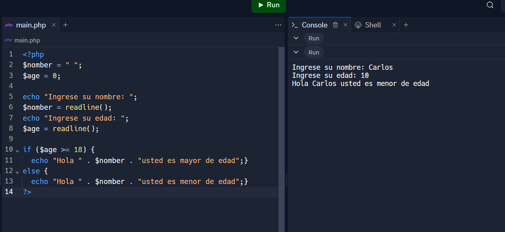

<h1> Taller - 10 Carlos Alberto Cortes Leonel</h1>

<h2>Información</h2>

 Curso: Full Stack Basico - Grupo 1 

Profesor: Cristian Pastiño

<h2>punto 1: constantes y variables</h2>

<h2>punto 2: Sumas de constantes y variables</h2>

<h2>punto 3: Sumas de dos numero indicados por el usuario </h2>

<h2>punto 4: Datos del usuario en consola</h2>

<h2>punto 5: Entrada de bolera usando if / else</h2>

<h2>punto 6: Detencion de mayoría de edad</h2>

<h2>punto 7: Seleccion de operación arimetica </h2>

<h2>punto 8: Entrada a la bolera usando Switch</h2>

<h2>punto 9: Tabla de multiplicar usando While</h2>

<h2>punto 10: Numeros pares usando while</h2>

<h2>punto 11: Numeros impares usando for</h2>

<h2>punto 12: Tabla de multiplacar usando for</h2>

<h2>punto 13: Suma de valores de un arreglo usando foreach</h2>

<h2>punto 14: Revisión de contraseña </h2>

<h2>punto 15: Seleccion de operación arimetrica usando funciones</h2>

